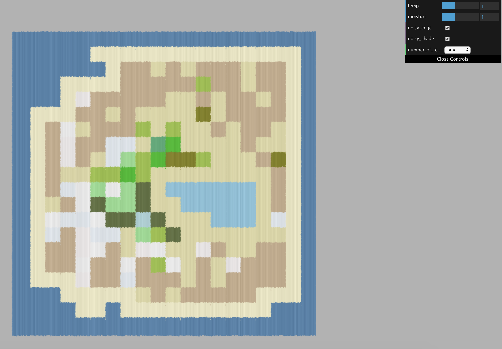
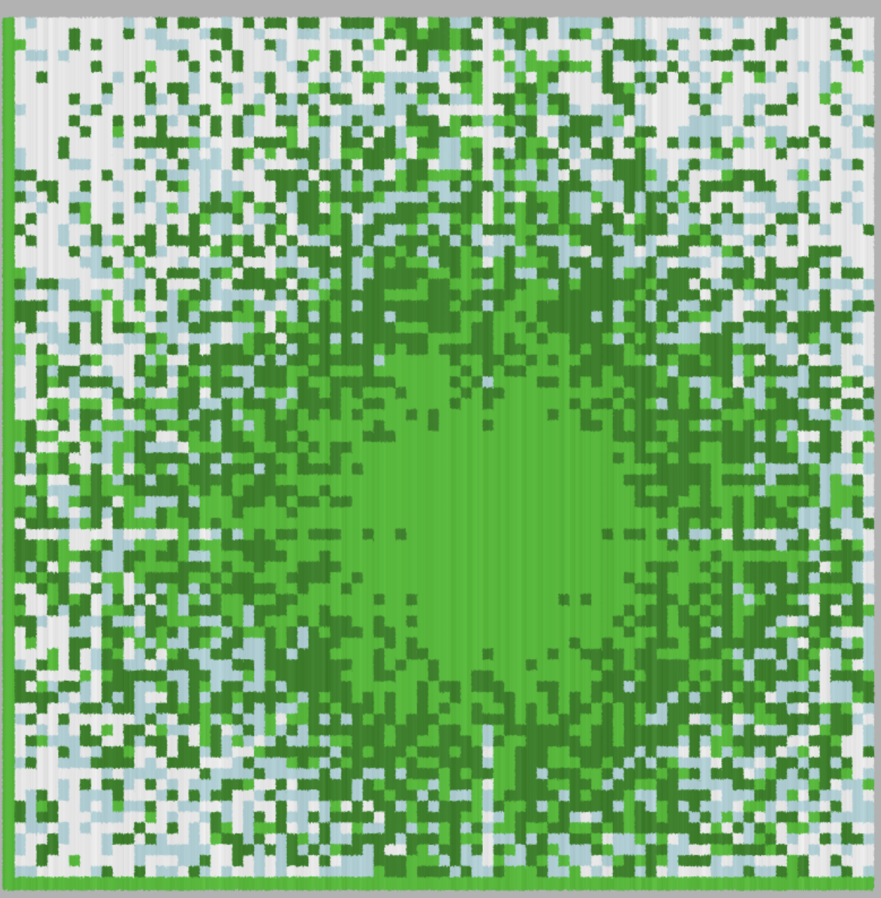
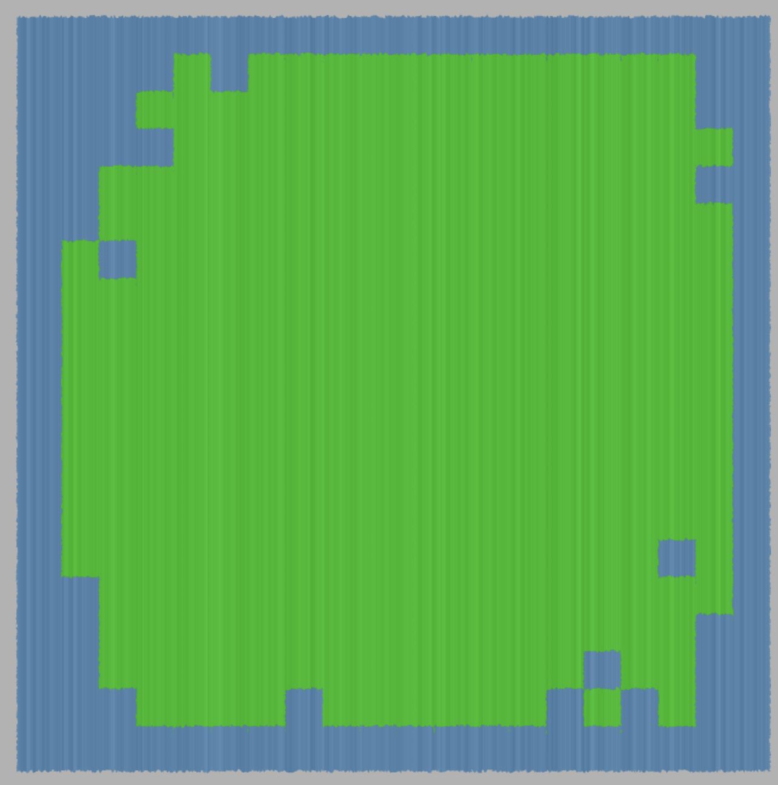
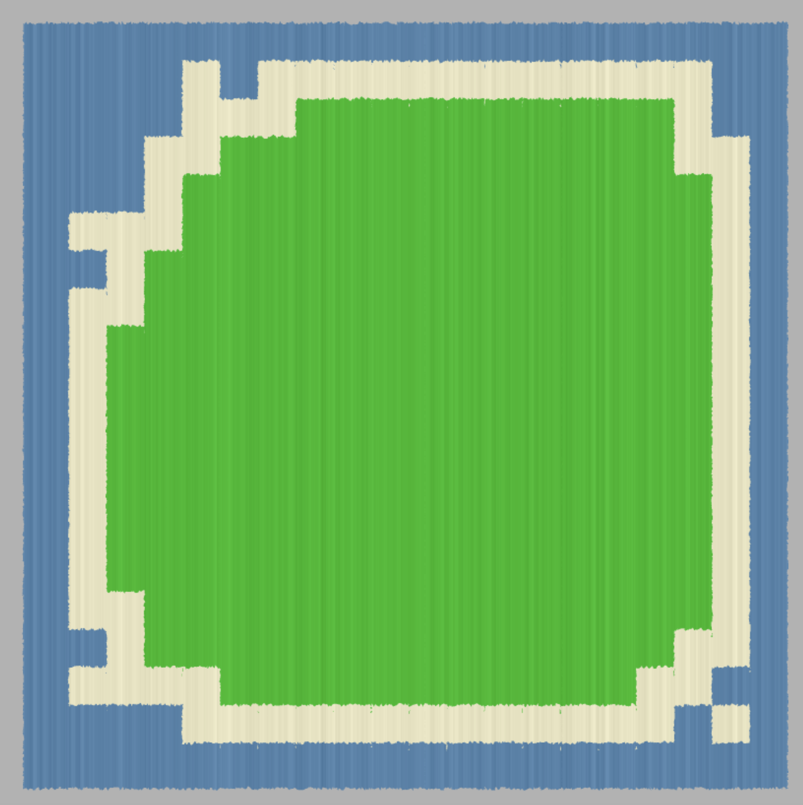
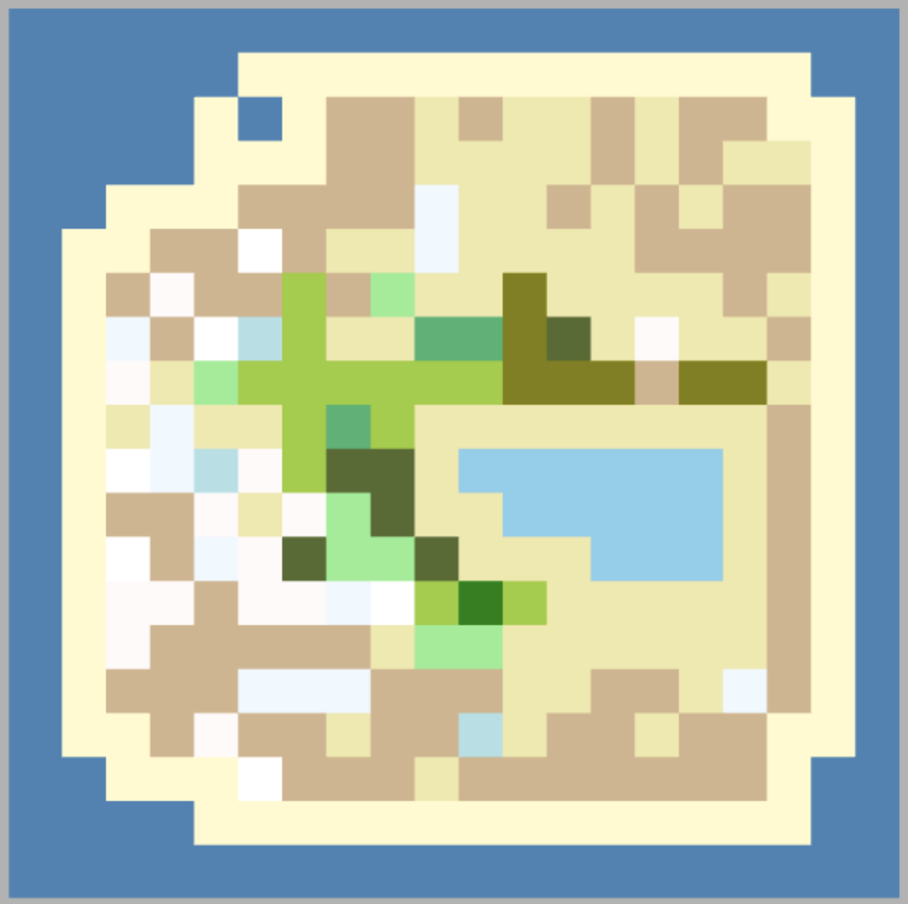

# CPU Generated 2D Map

 Wendy Sun (wentings)

## Demo
### https://wentings.github.io/566-final/

## Implementation
### The Map on the CPU
The map is stored as a biomeGrid, full of objects of Biomes. Each biome has 5 attributes: boolean ocean, coast, and water, and float temperature, moisture. These five attributes generate a biomeType, which determines the color of the biome. Each biome also has a size, depending on the number of regions the map has: the higher number of regions, each biome is smaller.

The biomeGrid itself populates the biome makeup of the map. First, all the biomes are stored in a 1D array using its x and y index in the grid. For the small map, each index increased by 1. For the medium map, each index increased by 0.5. For the large map, each index only increases by 0.25. This is how I increased the number of biomes in a fixed size grid.

After populating each x and y indexed position in the grid with a default biome set to the temperature and moisture determined by the GUI, which is the highest temperature and moisture a biome can have. First, the moisture and the temperature of each biome is reset with new values. The center biome at (0,0) and (1, -2) arbitrarily chosen as the highest temperature and highest moisture. Moving from the corners in, each biome's temperature and moisture are decreased by how far its x and y index are from the center biomes multiplied by a random probability between a range. This creates a map with radially decreasing temperature and moisture from the chosen center.

After setting the temperature, the ocean biomes are set. Ocean biomes are set by setting the ocean boolean of biome to be true, regardless of its other attributes. The outer rim of biomes are all set to be ocean, and the probability of biomes to be set as ocean decreases as its x and y values are farther away from the edge.

The coast biomes are set to any biomes neighboring an ocean biome.

Lastly, I only implemented setting lake and marshes biomes for the small number of regions map as the lake had to be manually set. The marshes biomes are set for any biomes neighboring a lake biome.

### The Map on the GPU
In the loadScene() function, a biomeGrid is generated with the GUI controlled temperature, moisture, and map size values. Each biome has a transformation and a color which is then instance rendered as a plane geometry. On the vertex shader, noise is added to the sides of the plane to perturb the edges. Noise is added in the fragment shader to add texture.

## Future Developments
RBG made its mesh using a vertex/edge data structure similar to a half-edge data structure to render its mesh, which made creating mesh in voronoi grid cells and adding vertices irregularly in each biome's edge possible. In the future, I want to re-do the structure of my mesh to allow that. Additionally, I want to add elevation as an attribute of biomes, and add rivers into my map that flow from the high elevations to low elevation. 

## Resources
Main Demo I was replicating: https://www.redblobgames.com/maps/mapgen2/

IQ for shader funs per usual: https://www.shadertoy.com/view/lsf3WH

Annie Su for her companionship as we worked on this project together <3 

Adam for convincing me not to trash this project
